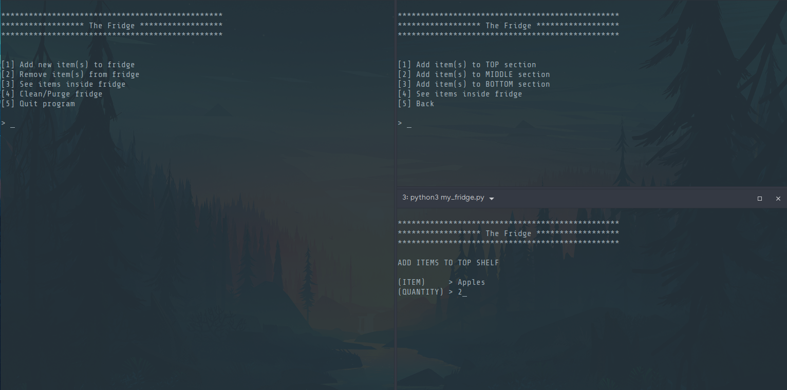

## Computer Science assignment/test

# Python Refrigerator Simulation

A terminal application that simulates the action of putting and grabbing items from a refrigerator. It was the assignment for a 45 minutes "Quiz"/Test during the second week of my Computer Science course.

### Minimal requirements
1. Putting items inside fridge
2. Grabbing items out of the fridge
3. Have a top, middle and bottom shelf where items can be stored.
4. Each shelf can only contain 15 items.

